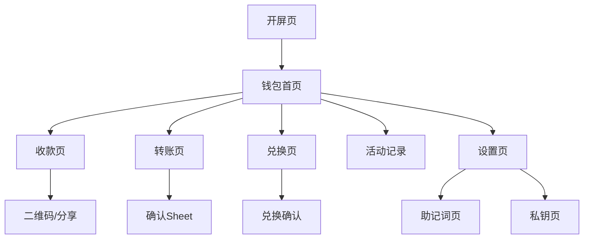

## 1. 产品概述
雷达钱包（Radar Wallet）是一款全球化、高端、金融级的去中心化多链AA钱包，专为追求安全性和专业性的数字资产用户设计。产品支持多钱包、多账户、多链管理，可直接上架App Store和Google Play。

解决用户管理多链数字资产复杂、安全性不足的问题，提供简洁专业的机构级金融体验。

## 2. 核心功能

### 2.1 用户角色
| 角色 | 注册方式 | 核心权限 |
|------|----------|----------|
| 普通用户 | 创建/导入钱包 | 管理钱包、转账、兑换、查看资产 |

### 2.2 功能模块
雷达钱包包含以下核心页面：
1. **开屏页**：品牌展示、安全声明
2. **钱包首页**：资产总览、三重切换、快捷操作
3. **收款页**：地址展示、二维码、分享功能
4. **转账页**：选择代币、输入地址、确认转账
5. **兑换页**：代币兑换、费用显示
6. **活动记录**：交易历史、分类筛选
7. **设置页**：钱包管理、安全设置、网络配置
8. **助记词页**：备份恢复短语
9. **私钥页**：导出私钥、安全警告

### 2.3 页面详情
| 页面名称 | 模块名称 | 功能描述 |
|----------|----------|----------|
| 开屏页 | 品牌展示 | 显示R字母Logo和雷达钱包名称，淡入动画效果 |
| 开屏页 | 安全声明 | 显示"Secure · Non-Custodial · Global"标语 |
| 钱包首页 | 顶部导航 | 显示R Logo、钱包名称、设置入口 |
| 钱包首页 | 三重切换 | Wallet/Account/Network下拉选择和切换 |
| 钱包首页 | 资产总览 | 显示总余额和当前账户地址，支持复制和二维码 |
| 钱包首页 | 快捷操作 | Receive、Send、Swap三个主要功能按钮 |
| 钱包首页 | 资产列表 | 显示当前链的2-3个主流资产及余额 |
| 收款页 | 代币选择 | 选择要收款的代币类型 |
| 收款页 | 地址展示 | 大号显示当前账户地址 |
| 收款页 | 二维码 | 生成当前地址的二维码 |
| 收款页 | 操作按钮 | Copy和Share功能按钮 |
| 转账页 | 代币选择 | 第一步选择要转账的代币 |
| 转账页 | 转账信息 | 第二步输入接收地址和转账金额 |
| 转账页 | 费用提示 | 显示网络费用（RADRS支付） |
| 转账页 | 确认Sheet | 第三步确认转账详情 |
| 兑换页 | 兑换输入 | From区域选择代币和输入金额 |
| 兑换页 | 兑换输出 | To区域选择目标代币和显示预估金额 |
| 兑换页 | 费用显示 | 显示网络费用（RADRS支付） |
| 活动记录 | 分类筛选 | All/Wallet/Swap分类标签 |
| 活动记录 | 交易列表 | 显示Send/Receive/Swap/Contract记录 |
| 活动记录 | 交易详情 | 点击查看Tx Hash，跳转区块浏览器 |
| 设置页 | 账户管理 | 钱包管理、备份助记词、导出私钥 |
| 设置页 | 安全设置 | App锁、生物识别等安全选项 |
| 设置页 | 网络配置 | RPC设置等高级网络选项 |
| 设置页 | 法律信息 | 服务条款和隐私政策 |
| 助记词页 | 安全显示 | 默认模糊显示，Reveal需生物识别 |
| 助记词页 | 风险提示 | 显示强风险提示信息 |
| 私钥页 | 独立页面 | 单独页面显示私钥信息 |
| 私钥页 | 安全警告 | 强警告提示，禁止截图（系统支持时） |

## 3. 核心流程
用户首次使用流程：开屏页 → 创建/导入钱包 → 设置密码 → 进入钱包首页
日常操作流程：钱包首页 → 选择操作（Receive/Send/Swap）→ 完成操作 → 查看活动记录
钱包管理流程：设置页 → 钱包管理 → 创建新钱包/切换钱包/删除钱包
安全设置流程：设置页 → 备份助记词/导出私钥 → 生物识别验证 → 显示敏感信息

## 4. 用户界面设计

### 4.1 设计风格
- **主色**：Background Primary #0B0D12，Background Secondary #151821，Card Background #1B1F2A
- **强调色**：Primary Accent (Gold) #C9A24D
- **文字色**：Primary Text #FFFFFF，Secondary Text #9AA0AE
- **功能色**：Success #2ECC71，Warning #F5A623，Error #E74C3C，Info #4A90E2
- **按钮风格**：简洁矩形按钮，圆角适中，突出功能性
- **字体**：Inter字体，数字使用等宽字体（Tabular Figures）
- **布局风格**：卡片式布局，层次分明，信息密度适中
- **图标风格**：线性图标，简洁锐利，符合金融科技感

### 4.2 页面设计概览
| 页面名称 | 模块名称 | UI元素 |
|----------|----------|--------|
| 开屏页 | 品牌展示 | 纯黑背景#0B0D12，金色R Logo居中，淡入动画300ms |
| 钱包首页 | 顶部导航 | R Logo + 雷达钱包文字 + 设置图标，白色文字 |
| 钱包首页 | 三重切换 | 下拉选择器，显示当前Wallet/Account/Network |
| 钱包首页 | 资产总览 | 金色#C9A24D显示总余额，地址显示支持复制 |
| 钱包首页 | 快捷操作 | 三个主要按钮：Receive/Send/Swap |
| 钱包首页 | 资产列表 | 卡片式列表，显示代币名称、余额，RADRS标注Gas用途 |
| 收款页 | 地址展示 | 大号字体显示地址，下方二维码 |
| 转账页 | 分步操作 | 三步流程清晰展示，费用提示明确 |
| 兑换页 | 兑换界面 | From/To区域清晰区分，不显示行情数据 |
| 设置页 | 分类设置 | 账户、安全、网络、法律信息分类清晰 |
| 助记词页 | 安全显示 | 默认模糊，Reveal按钮需生物识别 |
| 私钥页 | 警告界面 | 红色警告背景，禁止截图提示 |

### 4.3 响应式设计
产品采用移动端优先设计，适配iOS和Android平台，支持各种屏幕尺寸。触摸交互优化，按钮大小适合手指操作，滑动流畅。

### 4.4 字体规范
- 页面标题：20px，字重600
- 主资产：32px，字重600
- 列表标题：16px，字重500
- 正文：14px，字重400
- 辅助说明：12px，字重400

### 4.5 合规原则
- ❌ 不出现收益相关表述
- ❌ 不展示行情涨跌数据
- ❌ 不出现托管暗示
- ✔ 明确非托管性质
- ✔ 强调私钥本地存储
- ✔ 符合App Store审核要求